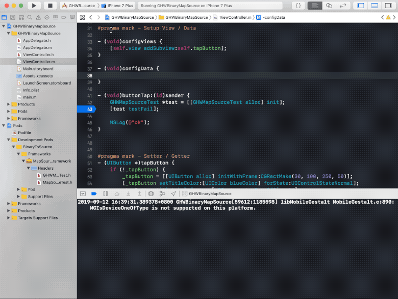

# 使用 Python 和 LLDB 解决二进制 Pod 到源码映射问题

## 前言

随着公司业务不断发展，组件化已经成为趋势，大多都是将各个组件拆分为一个个 Pod，然后通过 Podfile 集成到一起。为了加快编译速度，很多 Pod 组件都会做出二进制的形式，提前编译好，然而这样又带来一个问题就是如果二进制 Pod 中发生 crash 的话，我们得到的只能是一些看不懂的汇编代码，无法单步调试。本文的方案可以解决这个问题，实现二进制到源码的映射，同事能够实现单步调试。  

整个操作流程如下  
